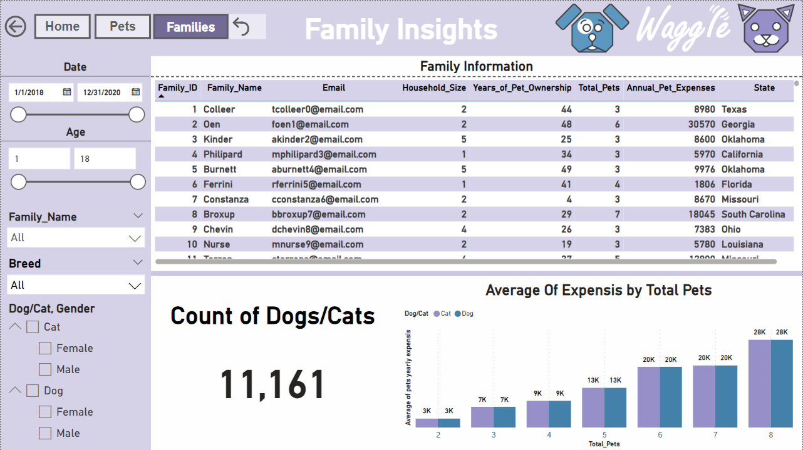
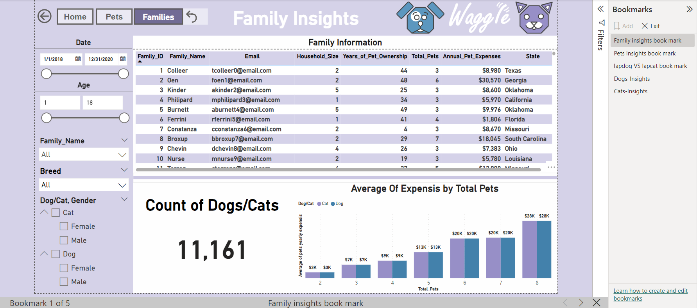
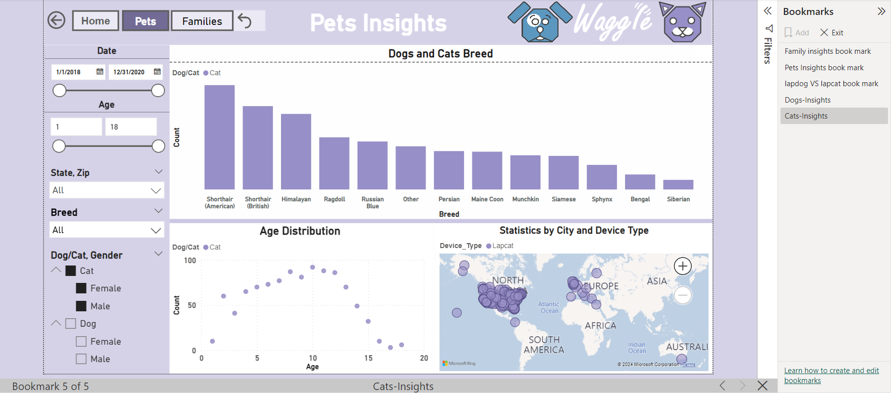
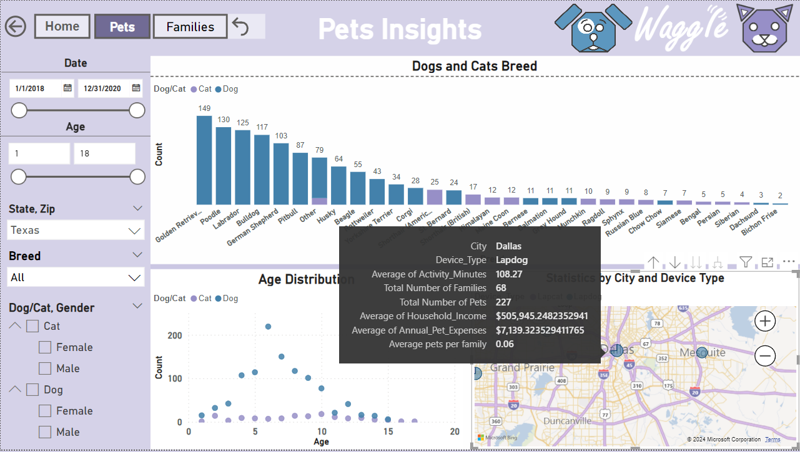

# Building-a-PowerBI-Report-for-Waggle-Lapdog-VS-Labcat
#### Udacity data visualization project

## PROJECT OVERVIEW
#### You work as a business intelligence analyst for Waggle, a startup that makes smart devices for pets. Recently, Waggle has been thrilled by the success of their new Lapdog device, a fitness collar that lets owners track their dog’s steps, alerts them when it’s time for a walk, and even repels fleas! Reviews have been fantastic, sales are growing, and—best of all—the product really works! This success has led Waggle’s CEO to push for a feline version but there are concerns about its viability. For this reason, the product team distributed 1,000 Lapcat prototypes for field testing. Now, after months of data collection, you have been tasked with delivering a boardroom-ready Power BI report that tells the story of how the Lapcat data compares to findings from the dog collar Lapdog devices. You’re excited because your work will be presented at the highest levels of the company and will either help convince the CEO that Lapcat is the next big thing or a costly mistake to be avoided.

## BUSINESS REQUESTS
+ The CEO is curious about the following questions:
  * Did the average daily steps increase for cats wearing the device as they did for dogs?
  * Were owners of Lapcat devices as satisfied with the product as Lapdog owners?
+ The Chief Marketing Officer would like your report to be “on-brand” by including only colors from the Waggle color palette, the Waggle logo, and other approved company logos and icons.
+ The product team trusts you to incorporate other visuals and insights as you see fit but is most interested in demographic comparisons between the dogs and cats using Waggle devices as well as any information about the families who own the pets. They would also like slicers to help them filter and explore on their own.

## PROJECT STEPS
1. Review the included data model and business questions and identify which fields can be used to design metrics that answer the CEO’s questions. (That's all, just understand the data!)
1. Develop one or more visualizations that specifically address the CEO’s questions about whether there was a difference in average daily steps over time between the two devices and how Lapcat owners rated their device compared to Lapdog owners.
1. Address the product team’s request for demographic insights, using each of the following visuals at least once: Bar chart, line chart, donut chart, table/matrix, scatter plot, bubble map, and card.
1. Place your data visualizations and design an appropriate layout that emphasizes the most important findings first, with the CEO's questions answered on the first page, insights about the differences between dogs and cats on the second, and insights about the families who own the pets on the third.
1. In your data visualizations, incorporate the branding elements requested by the Chief Marketing Officer.
1. Please include at least five slicers on each page with at least one example of a drop-down slicer, at least one example of a slider slicer, at least one example of a hierarchy slicer, at least one example of a slicer with “Select All” enabled, and one example of a slicer with the search box enabled.
1. Create at least two bookmark features. One must allow users to dynamically swap one visual out with a different one and another must reset all applied filters on the page.
1. Create buttons that help your users navigate your report. Buttons must respond when users hover over them by changing color or size (or both!).

## DATA SOURCE
#### Data in the form of an excel file was provided by Udacity.

## DATA MODELLING
### STAR SCHEMA

## ORGANIZING THE REPORT
### The report is organized according to the following guidelines:
  * The first page should highlight the CEO’s business questions, specifically calling out          the differences in average step count and average user rating (if any) between Lapdog and       Lapcat devices.
  * The second page should focus on insights related to pets using the device.
  * The third page should focus on insights related to the families that own the pets.

## Visualization
### The report contains four pages:
 * Home
 * Pets Insights
 * Family Insights
 * Family Summary

### Home 
#### It contains many visuals explaining the difference between Lapdog devices and Lapcat devices

### Pets Insights

### Family Insights

### Family Summary
#### You can access this page by choosing the family information row from the table on the Family Insights page and clicking on Drill through after that you can show the Summary for this family on this page

## KEY POWER BI FEATURES USED
 * Creating a custom theme
 * Bookmarks
 * Drill through
 * Drill-Down Bubble Map
 * Buttons for page navigation

### Creating a custom theme

### Bookmarks
#### Lapdog VS Lapcat Bookmark

#### Pets Insights Bookmark

#### Family Insights Bookmark

#### Dogs Bookmark
#### You can get the dog's insights only when you press on the dog logo in the header

#### Cats Bookmark
#### You can get the cat's insights only when you press on the cat logo in the header

#### To reset all filters on the page This bookmark is created and assigned to a button to make report interaction easier for users. Users would be able to reset all filters applied on the page at the click of a button.

### Drill through
#### Drill through in Power BI is a feature that allows you to create a destination target page in your report that focuses on a specific entity such as a supplier, customer, or manufacturer. When your report readers right-click a data point in other source report pages, they drill through to the target page to get details that are filtered to that context. In this report, the drill-through is created on the family report page and focuses on the family IDs. To see the details of each family users will have to right-click on the individual family IDs, hover over drill through, and click on “Drill-Through Summary”, explained above on the family insights page

### Drill-Down Bubble Map
#### Earlier in the instructions, you were asked to create a bubble map. The product team loved this feature and wants you to expand on the idea. They have requested the ability to drill-down into the map, specifically drilling from the state into the zip codes that make up the state.
#### They are curious if, when they hover over a bubble, the tooltip could tell them the following things about the data point in question:
 * Total Number of Families
 * Total Number of Pets
 * Average Household Income
 * Average Annual Pet Expenses
 * Average Number of Pets per Family

### Page Navigation
For ease of report navigation, buttons are provided on each report page to help users navigate to the other report pages. These buttons have hover effects so when report users hover over each button, a short message appears which tells the user what will happen if the button is clicked on, explained above on all pages

## Insights
 + Owners of LapCat devices were not as satisfied as owners of LapDog devices. This is evident in their ratings and recommendations as seen on the “Home” and “Pet” pages.
 + Average daily steps for cats wearing the device did not increase as compared to the dogs.
 + The dogs were relatively younger than the cats and this could affect their average daily steps.

### Thanks for reading and your feedbacks are welcome 

